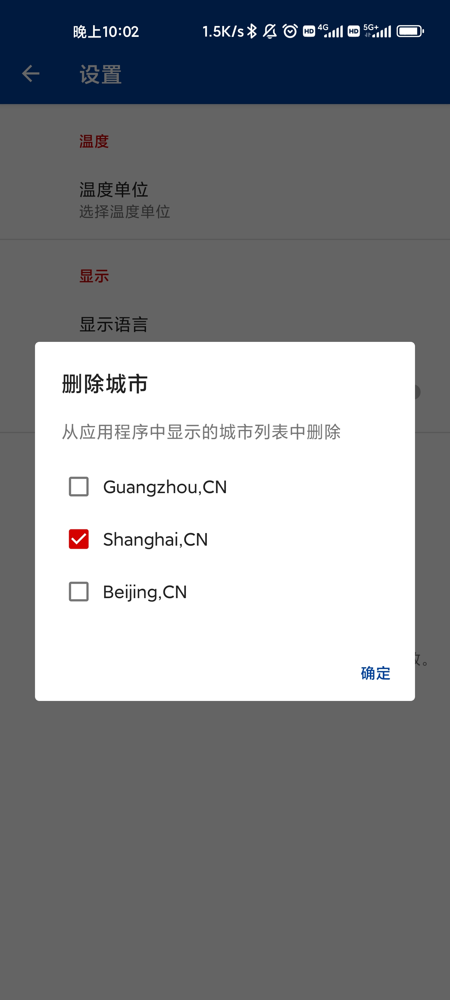

# 期末项目 - 微天气APP

> 作者：XXXXXXXX
>
> 学号：XXXXXXXX
>
> 课程：智能移动应用开发技术

[toc]

# 项目介绍

本次期末项目我使用了本学期所学的Android开发知识，开发了一个功能完善，界面美观，用户交互友好的天气查询APP，该APP具有如下功能：

## 1. 城市天气查询

### 1.1 基本天气数据查询

具体包括当前时刻的温度湿度、风力风向、降雨和降雪情况，今天的日出日落时间等等。

### 1.2 近十日的天气查询

显示近十日每天的最高、最低气温，早上/晚上/白天/夜晚的温度，当天的风力、降水、降雪、湿度和大气压数据。

## 2. 天气变化折线图

将近十日的气温、风向、降水等绘制成折线图，方便用户直观地看出天气变化趋势。

## 3. 天气地图

本功能会显示一个可交互的降雨、风力、温度地图，与天气预报所使用的大屏类似，方便用户快速查看某一片区域的天气情况。

## 4. 收藏城市

本APP还实现了一个侧边导航栏，用户可以将经常需要查询的城市收藏到侧边导航栏中。可以随时划出侧边导航栏中进行快速切换。

## 5. 程序设置界面

程序附带了一个设置界面，支持修改以下设置：

- 支持摄氏度和华氏度两种温度单位

- 支持修改程序界面语言（当前仅支持修改"星期x"的语言）

- 支持修改程序内使用的时间格式：使用12小时或24小时制

# 功能截图

## 程序Logo


## 首次启动提示界面


- 搜索功能说明


- 下拉刷新功能说明


- 定位功能说明


## 天气显示功能

- 主界面


- 点击近十日天气中任意一个天气图标，可以查看详细信息


- 定位功能


## 侧边导航栏（抽屉）

- 侧边导航栏


- 添加收藏城市


- 添加成功


## 天气变化折线图功能

- 折线图界面


- 点击右上角开关可以显示精确数值


## 天气地图功能

- 降雨地图


- 风力地图


- 温度地图


## 设置界面

- 设置主页面


- 温度单位选择


- 收藏列表删除



# 实现细节

## 概述

本项目主要代码使用Kotlin语言实现，少部分代码使用Java完成。项目源代码结构如下图所示：


项目中一共包含了4个activity和5个Fragment，分别位于activity和fragment包下面；

在model包下面的是传输的天气数据JSON结构；permissions包下的代码用于处理APP权限相关；utils包包含了一些杂项代码，用于发送网络请求等；perferences包用于设置和存储用户设置项。

项目代码量统计：

```bash
user@computer:weather$ cloc .
     113 text files.
     112 unique files.
      17 files ignored.

github.com/AlDanial/cloc v 1.90  T=0.04 s (2621.7 files/s, 174292.1 lines/s)
-------------------------------------------------------------------------------
Language                     files          blank        comment           code
-------------------------------------------------------------------------------
XML                             52            203             52           2267
Kotlin                          26            204             31           1847
Java                            13            157             19            956
CSS                              3             49             25            419
Bourne Shell                     1             23             36            126
Gradle                           3              7             10            110
Markdown                         1             73              0            109
DOS Batch                        1             21              2             66
HTML                             1              7              0             60
JavaScript                       2              0              7              7
ProGuard                         1              3             18              0
-------------------------------------------------------------------------------
SUM:                           104            747            200           5967
-------------------------------------------------------------------------------
```

可以看出，整体项目大约包含了2200行xml配置、1800行kotlin代码和900行Java代码。

## 项目架构

本项目使用了MVVM架构，其中ViewModel使用了Kotlin协程实现，代码如下：

## 第三方库

开发中使用了若干第三方库，使用的Gradle配置如下：

```gradle
dependencies {
    // kotlin
    implementation "org.jetbrains.kotlin:kotlin-stdlib:$kotlin_version"
    implementation "org.jetbrains.kotlinx:kotlinx-coroutines-android:$kotlinx_coroutines_version"
    // android
    implementation 'com.google.code.gson:gson:2.10'
    implementation 'androidx.cardview:cardview:1.0.0'
    implementation 'androidx.appcompat:appcompat:1.5.1'
    implementation 'androidx.preference:preference:1.2.0'
    implementation "androidx.recyclerview:recyclerview:1.2.1"
    implementation "androidx.annotation:annotation:1.5.0"
    implementation "com.google.android.material:material:1.7.0"
    implementation 'androidx.constraintlayout:constraintlayout:2.2.0-alpha04'
    implementation 'androidx.swiperefreshlayout:swiperefreshlayout:1.1.0'
    implementation "androidx.lifecycle:lifecycle-viewmodel:$lifecycle_version"
    implementation "androidx.lifecycle:lifecycle-viewmodel-ktx:$lifecycle_version"
    // third party
    implementation 'uk.co.samuelwall:material-tap-target-prompt:3.3.2'
    implementation 'com.github.PhilJay:MPAndroidChart:v3.0.2'
    implementation 'com.mikepenz:iconics-core:3.2.5'
    implementation 'com.mikepenz:materialdrawer:6.1.2'
    implementation 'com.mikepenz:weather-icons-typeface:2.0.10.4@aar'
    implementation 'com.mikepenz:google-material-typeface:3.0.1.2.original@aar'
    implementation 'com.mikepenz:material-design-iconic-typeface:2.2.0.4@aar'
    implementation 'com.afollestad.material-dialogs:core:3.3.0'
    implementation 'com.afollestad.material-dialogs:input:3.3.0'
    implementation 'com.jakewharton:butterknife:10.2.3'
    implementation 'com.github.matthiasrobbers:shortbread:1.4.0'
}
```

同时启用了安卓视图绑定的功能，方便在代码中获取组件的引用：

```gradle
android {
    viewBinding {
        enabled = true
    }
}
```

## 整体设计

APP整体设计遵循了Google提出的Material design设置规范，大量采用了MD设计风格的组件。

APP的主界面是一个`GlobalActivity`，作为整个APP的入口。首次启动时，会跳转到`FirstLaunchActivity`，引导用户进行城市设置，然后进入`WeatherActivity`。后续启动时，会直接进入`WeatherActivity`。

`FirstLaunchActivity`中包含了一个输入框和按钮，用于输入城市名称。点击按钮后，会启动`WeatherActivity`。

`WeatherActivity`中包含了一个`WeatherFragment`，用于显示当前天气信息。其中未来十天的天气信息使用了一个自定义的Fragment展示。

`MySettingsFragment`是一个`PreferenceFragmentCompat`的子类，用于设置界面。

## 天气数据

APP的天气数据使用了OpenWeatherApi提供的免费接口，接口返回的数据格式如下：

```json
{
    "cod": "200",
    "message": 0,
    "cnt": 7,
    "list": [
        {
            "dt": 1610006400,
            "sunrise": 1609980000,
            "sunset": 1610023200,
            "temp": {
                "day": 2.5,
                "min": -1.5,
                "max": 2.5,
                "night": -1.5,
                "eve": 0.5,
                "morn": 2.5
            },
            "feels_like": {
                "day": -0.5,
                "night": -4.5,
                "eve": -2.5,
                "morn": -0.5
            },
            "pressure": 1020,
            "humidity": 80,
            "dew_point": -0.5,
            "wind_speed": 3.5,
            "wind_deg": 0,
            "weather": [
                {
                    "id": 800,
                    "main": "Clear",
                    "description": "clear sky",
                    "icon": "01d"
                }
            ],
            "clouds": 0,
            "pop": 0,
            "uvi": 1.5
        },
    ],
    "city": {
        "id": 1816670,
        "name": "Shenzhen",
        "coord": {
            "lat": 22.547,
            "lon": 114.0859
        },
        "country": "CN",
        "population": 1000000,
        "timezone": 28800,
        "sunrise": 1609980000,
        "sunset": 1610023200
    },
}
```

接口返回的数据格式比较复杂，因此需要使用`gson`库来实现json的序列化和反序列化。`gson`库的使用方法如下：

```java
Gson gson = new Gson();
String json = gson.toJson(object);
Object object = gson.fromJson(json, Object.class);
```

## 数据存储

APP的数据存储使用了`SharedPreferences`，用于存储用户的设置信息。

APP的天气数据不进行存储，而是每次启动APP时都从网络请求最新的数据。

## 网络请求

APP的网络请求使用了android提供的`HttpURLConnection`类，用于请求OpenWeatherApi提供的接口。`HttpURLConnection`类提供了一个`connect`方法，用于建立与服务器的连接，然后使用`getInputStream`方法获取服务器返回的数据流，最后使用`gson`库将数据流反序列化为`Weather`对象。

## 图标&主题

APP的图标从网络上获取，主题是自己绘制的。
